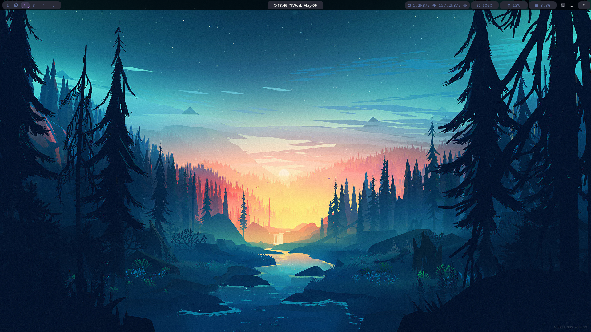
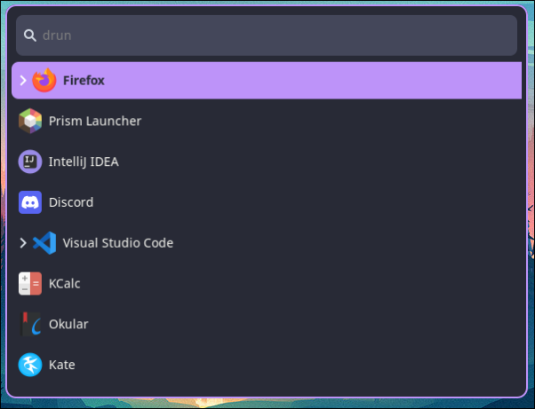
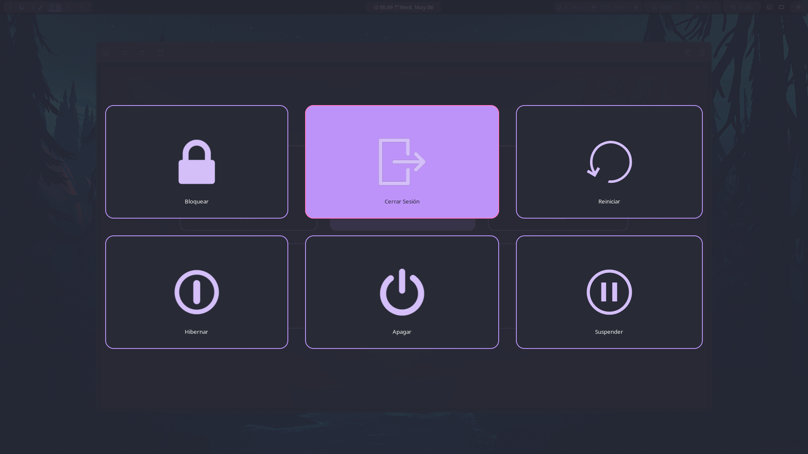
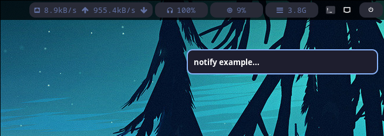
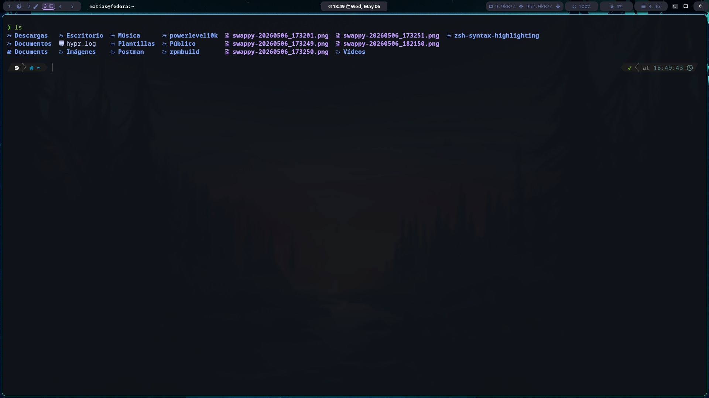

# 🐧 Hyprland Dotfiles | Fedora 43 KDE Plasma

Bienvenido a mi repositorio de configuraciones personales (**dotfiles**). Este entorno está basado en **Hyprland** y optimizado para el desarrollo de software.


## 🖥️ Especificaciones del Sistema
* **CPU:** AMD Ryzen 5 2400G
* **GPU:** AMD Radeon RX 580 (8GB)
* **RAM:** 16GB DDR4
* **Display:** 1920x1080 @ 144Hz (Puerto `DP-1`)

## 🛠️ Suite de Software
* **Compositor:** Hyprland
* **Barra de Estado:** Waybar (personalizada con iconos de aplicaciones activas)
* **Terminal:** Kitty (JetBrainsMono Nerd Font)
* **Notificaciones:** Dunst (Estilo minimalista)
* **Lanzador:** Wofi
* **Gestión de Energía:** Wlogout (Tema Dracula personalizado)
* **Extras:** `xwaylandvideobridge` para captura de pantalla en Discord/OBS.

## 📁 Estructura del Repositorio
```text
.
├── hypr/           # Configuración de Hyprland (monitores, binds, reglas)
├── waybar/         # Estilos CSS y configuración JSONC de la barra
├── kitty/          # Atajos y fuentes de la terminal
├── dunst/          # dunstrc para notificaciones
├── wofi/           # Estilos del lanzador
└── wlogout/        # Layout y CSS del menú de apagado
```






## 🚀 Instalación y Recuperación
Si acabas de formatear o querés aplicar estas configs en una instalación limpia de Fedora:
1. **Instalación de paquetes necesarios**
```bash
sudo dnf install hyprland waybar kitty dunst wofi wlogout \
jetbrains-mono-fonts-all google-noto-emoji-color-fonts \
libappindicator-gtk3 xwaylandvideobridge
```
2. **Clonar el repositorio**
```bash
git clone [https://github.com/matiasOliva64/dotfiles.git](https://github.com/matiasOliva64/dotfiles.git) ~/dotfiles
cd ~/dotfiles
```
3. **Despliegue de archivos**\
He incluido este pequeño comando para automatizar el respaldo de lo actual y la aplicación de lo nuevo:
```bash
# Crear backup de lo existente
mkdir -p ~/.config/backup_old_dots
mv ~/.config/{hypr,waybar,kitty,dunst,wofi,wlogout} ~/.config/backup_old_dots/

# Aplicar configs
cp -r ~/dotfiles/{hypr,waybar,kitty,dunst,wofi,wlogout} ~/.config/
```
## ⌨️ Atajos Clave (Keybinds)
- Super + Q -> Abrir Terminal (Kitty)

- Super + C -> Cerrar ventana activa

- Super + M -> Menú de Apagado (Wlogout)

- Super + E -> Explorador de archivos (Dolphin)

- Super + V -> Modo flotante

- Super + Space -> Lanzador de aplicaciones (Wofi)

- Super + . -> Selector de Emojis/Símbolos
## 💡 Notas de Configuración
- Monitor: Configurado a 144Hz en hyprland.conf usando la línea:
- monitor = DP-1, 1920x1080@144, 0x0, 1

